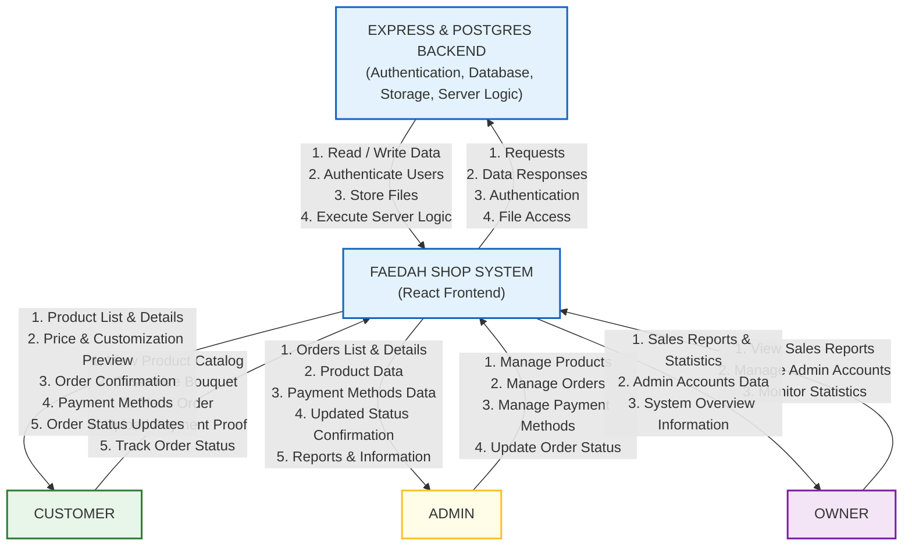

# Context Diagram & Data Flow Diagram — Faedah Shop

Dokumen ini mendokumentasikan DFD Level 0 (Context Diagram) dan DFD Level 1 dari sistem **Faedah Shop** setelah migrasi ke PostgreSQL lokal dan Express.js.

---

## Level 0 — System Context Diagram

Menggambarkan sistem **Faedah Shop** dan seluruh entitas eksternal yang berinteraksi dengannya. Pada level ini, sistem dibagi menjadi komponen klien (**React Frontend**) dan komponen server (**Express & Postgres Backend**) untuk menggambarkan aliran data di antara keduanya beserta aktor-aktor eksternal.

### 1. Diagram Mermaid (Grafis)



### 2. Diagram ASCII (Text-based)

```
                                     ┌──────────────────────────────────────────┐
                                     │       EXPRESS & POSTGRES BACKEND         │
                                     │  (Auth, Database, Storage, Server Logic) │
                                     └───────────────────▲──────────────────────┘
                                                         │ ▲
                                       Requests, Data    │ │ Read/Write Data,
                                       Responses, Auth,  │ │ Authenticate Users,
                                       File Access       │ │ Store Files,
                                                         │ │ Exec Server Logic
                                                         ▼ │
 ┌──────────────────────┐             ┌──────────────────┴──────────────────────┐             ┌──────────────────────┐
 │                      ├────────────►│                                         │◄────────────┤                      │
 │       CUSTOMER       │             │           FAEDAH SHOP SYSTEM            │             │        ADMIN         │
 │                      │◄────────────┤            (React Frontend)             ├────────────►│                      │
 └──────────────────────┘             └──────────────────┬──────────────────────┘             └──────────────────────┘
  - View Product Catalog                                 │ ▲                                   - Manage Products
  - Customize Bouquet                                    │ │ View Sales Reports,               - Manage Orders
  - Place Order                        Sales Reports &   │ │ Manage Admin Accounts,            - Manage Payment Methods
  - Upload Payment Proof               Statistics, Admin │ │ Monitor Statistics                - Update Order Status
  - Track Order Status                 Accounts Data,    │ │                                   
                                       System Overview   │ │                                   - Orders List & Details
  - Product List & Details             Information       ▼ │                                   - Product Data
  - Price & Customization Preview                      ┌─┴──────────────────────┐              - Payment Methods Data
  - Order Confirmation                                 │                        │              - Updated Status Conf.
  - Payment Methods                                    │         OWNER          │              - Reports & Info
  - Order Status Updates                               │                        │
                                                       └────────────────────────┘
```

---

## Entitas Eksternal (External Entities)

| Entitas | Deskripsi | Informasi yang Dikirim ke Sistem (Input) | Informasi yang Diterima dari Sistem (Output) |
|---|---|---|---|
| **Customer** | Pengguna umum yang melihat katalog dan memesan bouquet secara kustom | View Product Catalog, Customize Bouquet, Place Order, Upload Payment Proof, Track Order Status | Product List & Details, Price & Customization Preview, Order Confirmation, Payment Methods, Order Status Updates |
| **Admin** | Staff toko yang mengelola operasional harian bouquet | Manage Products, Manage Orders, Manage Payment Methods, Update Order Status | Orders List & Details, Product Data, Payment Methods Data, Updated Status Confirmation, Reports & Information |
| **Owner** | Pemilik toko dengan hak akses penuh terhadap data keuangan dan admin | View Sales Reports, Manage Admin Accounts, Monitor Statistics | Sales Reports & Statistics, Admin Accounts Data, System Overview Information |
| **Express & Postgres Backend** | Komponen server lokal yang melayani logika bisnis dan penyimpanan data | Requests, Data Responses, Authentication, File Access | Read / Write Data, Authenticate Users, Store Files, Execute Server Logic |

> [!NOTE]
> Pada diagram konteks di atas, **Backend (Express & Postgres Backend)** digambarkan secara terpisah untuk memperjelas batas interaksi antara aplikasi klien (*React Frontend*) dengan layanan server (*Backend API*).

---

## Level 1 — Data Flow Diagram (DFD)

Menguraikan proses tunggal `0.0` dari Level 0 menjadi sub-proses utama, lengkap dengan aliran data ke **Data Store** internal.

### 1. Diagram Level 1 (Mermaid)

```mermaid
flowchart TD
    %% Entities
    Pelanggan([Pelanggan])
    Admin([Admin])
    Owner([Owner])

    %% Data Stores
    D1[(D1. Users Table)]
    D2[(D2. Products Table)]
    D3[(D3. Orders Table)]
    D4[(D4. Payment Methods Table)]
    D5[(D5. File Storage /uploads/)]

    %% Processes
    P1((1.0<br>Autentikasi &<br>Akun))
    P2((2.0<br>Manajemen<br>Katalog))
    P3((3.0<br>Pemesanan &<br>Kustomisasi))
    P4((4.0<br>Pembayaran &<br>Bukti Transfer))
    P5((5.0<br>Pelacakan &<br>Kelola Pesanan))
    P6((6.0<br>Laporan &<br>Statistik))

    %% Flows - Process 1.0 (Auth)
    Pelanggan -->|Kredensial Reg/Login| P1
    Admin -->|Kredensial Login Admin| P1
    Owner -->|Kredensial Login Owner| P1
    P1 <-->|Validasi & Ambil Data| D1
    P1 -->|JWT Token / Status Login| Pelanggan
    P1 -->|JWT Token / Status Login| Admin
    P1 -->|JWT Token / Status Login| Owner

    %% Flows - Process 2.0 (Katalog)
    Pelanggan -->|Request Katalog| P2
    Admin -->|CRUD Data Produk| P2
    P2 <-->|Read/Write Produk| D2
    P2 -->|Daftar Produk & Katalog| Pelanggan
    P2 -->|Konfirmasi Update Produk| Admin

    %% Flows - Process 3.0 (Pemesanan & Kustomisasi)
    Pelanggan -->|Data Pesanan & Kustomisasi| P3
    Pelanggan -->|Upload Foto Referensi| P3
    P3 -->|Simpan Foto Referensi| D5
    D5 -->|Return File URL/Path| P3
    P3 -->|Baca Harga & Addon| D2
    P3 -->|Simpan Pesanan Baru| D3
    P3 -->|No Pesanan & Ringkasan Harga| Pelanggan

    %% Flows - Process 4.0 (Pembayaran)
    Pelanggan -->|Request Metode Bayar| P4
    Pelanggan -->|Upload Bukti Transfer| P4
    Admin -->|CRUD Metode Bayar| P4
    P4 <-->|Read/Write Metode Bayar| D4
    P4 -->|Simpan Bukti Transfer| D5
    P4 -->|Update Status Pembayaran| D3
    P4 -->|Konfirmasi Upload| Pelanggan

    %% Flows - Process 5.0 (Pelacakan & Kelola Pesanan)
    Pelanggan -->|Cek Status (No Pesanan)| P5
    Admin -->|Update Status Pesanan| P5
    P5 <-->|Read/Write Status & Detail| D3
    P5 -->|Status & Detail Pelacakan| Pelanggan
    P5 -->|Detail Pesanan Masuk| Admin

    %% Flows - Process 6.0 (Laporan & Statistik)
    Owner -->|Req Laporan & Statistik| P6
    Owner -->|CRUD Akun Admin| P6
    P6 <-->|Read Data Pesanan| D3
    P6 <-->|Read/Write Akun Admin| D1
    P6 -->|Laporan & Dashboard Statistik| Owner

    %% Styling
    classDef aktor fill:#fff,stroke:#333,stroke-width:2px;
    classDef proses fill:#e1f5fe,stroke:#0288d1,stroke-width:2px;
    classDef store fill:#fff9c4,stroke:#fbc02d,stroke-width:2px;
    class Pelanggan,Admin,Owner aktor;
    class P1,P2,P3,P4,P5,P6 proses;
    class D1,D2,D3,D4,D5 store;
```

### 2. Daftar Sub-Proses DFD Level 1

1.  **1.0 Autentikasi & Akun**: Menangani login/register pelanggan, login admin/owner, verifikasi JWT token, serta otorisasi hak akses (*Role Guard*).
2.  **2.0 Manajemen Katalog**: Menyajikan daftar katalog produk beserta ukuran & addon kepada pelanggan, serta menyediakan fitur CRUD (Create, Read, Update, Delete) produk bagi Admin.
3.  **3.0 Pemesanan & Kustomisasi**: Memproses kustomisasi bouquet (pilihan ukuran, penambahan addon, deskripsi teks, dan upload foto referensi), menghitung perkiraan harga, serta membuat data pesanan baru berstatus `menunggu_pembayaran`.
4.  **4.0 Pembayaran & Bukti Transfer**: Menyediakan daftar metode pembayaran (nomor rekening/e-wallet), menerima upload bukti transfer dari pelanggan, menyimpannya di disk lokal, dan memperbarui status pesanan.
5.  **5.0 Pelacakan & Kelola Pesanan**: Memungkinkan pelanggan melacak pesanan via nomor pesanan (`FLR-XXXXXX`), serta memfasilitasi admin untuk memproses pesanan dan mengupdate statusnya (`dalam_proses` → `siap_diambil` → `selesai`).
6.  **6.0 Laporan & Statistik**: Mengagregasikan data pesanan dan penjualan dari database menjadi grafik statistik pendapatan, produk terlaris, serta memfasilitasi Owner untuk mengelola akun admin toko.

### 3. Daftar Data Store (Penyimpanan Internal)

*   **D1 Users Table**: Menyimpan data kredensial akun pelanggan, admin, dan owner (ID, email, password terenkripsi, nama, role).
*   **D2 Products Table**: Menyimpan data katalog (ID produk, nama, base_price, deskripsi, foto default, variasi ukuran, dan pilihan addon).
*   **D3 Orders Table**: Menyimpan data transaksi (order ID, order number, detail kustomisasi bouquet, total harga, status, alamat, nomor HP, nama penerima, link foto referensi, dan link bukti transfer).
*   **D4 Payment Methods Table**: Menyimpan daftar rekening/e-wallet pembayaran yang aktif milik toko.
*   **D5 File Storage (`/uploads/`)**: Folder lokal di server untuk menyimpan file biner gambar (foto referensi bouquet kustom dan foto bukti transfer).

---

## Aliran Data Utama (Data Flow Matrix)

### Input Aliran Data (Ke Proses)

| ID Flow | Dari Entitas / Store | Ke Proses | Nama Aliran Data | Isi Data |
|---|---|---|---|---|
| F01 | Pelanggan / Admin / Owner | 1.0 Auth | Kredensial Login | email, password |
| F02 | Pelanggan | 2.0 Katalog | Request Katalog | - |
| F03 | Admin | 2.0 Katalog | CRUD Produk | objek produk, ukuran, addon |
| F04 | Pelanggan | 3.0 Pemesanan | Data Kustomisasi & Pesan | productId, sizeId, addonIds, deskripsi, alamat |
| F05 | Pelanggan | 3.0 Pemesanan | Foto Referensi Bouquet | file gambar referensi |
| F06 | Pelanggan | 4.0 Pembayaran | Bukti Transfer | file gambar bukti bayar |
| F07 | Admin | 4.0 Pembayaran | CRUD Metode Bayar | nama bank, nomor rekening, atas nama |
| F08 | Pelanggan | 5.0 Pelacakan | Cek Status Pesanan | nomor pesanan (orderNumber) / userId |
| F09 | Admin | 5.0 Pelacakan | Update Status Pesanan | orderId, status baru |
| F10 | Owner | 6.0 Laporan | Request Laporan & Statistik | rentang tanggal |
| F11 | Owner | 6.0 Laporan | CRUD Akun Admin | nama, email, password, role |

### Output Aliran Data (Dari Proses)

| ID Flow | Dari Proses | Ke Entitas / Store | Nama Aliran Data | Isi Data |
|---|---|---|---|---|
| F12 | 1.0 Auth | Pelanggan / Admin / Owner | JWT Token & Status Login | JWT Token, data profil user, status auth |
| F13 | 2.0 Katalog | Pelanggan | Daftar Produk | array produk, detail harga, foto |
| F14 | 3.0 Pemesanan | Pelanggan | Ringkasan Order & No Pesanan | orderNumber, total harga kalkulasi |
| F15 | 4.0 Pembayaran | Pelanggan | Konfirmasi Upload Bukti | status upload (sukses/gagal) |
| F16 | 5.0 Pelacakan | Pelanggan | Detail Tracking Pesanan | status pesanan, riwayat update status |
| F17 | 5.0 Pelacakan | Admin | Detail Pesanan Masuk | daftar pesanan terfilter status |
| F18 | 6.0 Laporan | Owner | Dashboard & Laporan Stats | grafik pendapatan, statistik produk, data admin |

---

## Batas Sistem (System Boundary)

```
╔═══════════════════════════════════════════════════════════════════════╗
║                        FAEDAH SHOP SYSTEM                            ║
║                                                                       ║
║  ┌─────────────────────┐    ┌──────────────────────────────────────┐ ║
║  │   React Frontend    │    │      Express.js + PostgreSQL         │ ║
║  │   (Client-side)     │    │      (Server-side Lokal)             │ ║
║  │                     │    │                                      │ ║
║  │  - Routing          │◄──►│  - Node.js REST API (server.js)      │ ║
║  │  - State management │    │  - JWT + bcrypt (Lokal Auth)         │ ║
║  │  - UI components    │    │  - PostgreSQL Database               │ ║
║  │  - Form validation  │    │  - Disk Lokal File Storage           │ ║
║  │  - Price calculator │    │  - Middleware Autentikasi            │ ║
║  │  └─────────────────────┘    └──────────────────────────────────────┘ ║
║                                                                       ║
╚═══════════════════════════════════════════════════════════════════════╝

Di luar batas sistem:
  - Browser / Device pelanggan
  - Bank / Platform pembayaran (BCA, Mandiri, GoPay, OVO) — manual
  - Jasa pengiriman / kurir — offline
  - Unsplash (CDN foto produk) — eksternal
```

---

## Ringkasan Proses Bisnis

```
Pelanggan                                           Admin/Owner
    │                                                    │
    │  1. Lihat katalog bouquet                          │
    │  2. Pilih & kustomisasi                            │
    │  3. Isi data pengiriman                            │
    │  4. Pilih & bayar                                  │  5. Terima notif pesanan baru
    │  5. Upload bukti bayar                             │  6. Verifikasi pembayaran
    │                                                    │  7. Update status → "Dalam Proses"
    │  8. Cek status pesanan              ◄──────────────┤
    │     (menunggu → proses → siap)                     │  9. Rangkai bouquet
    │                                                    │  10. Update status → "Pesanan Siap"
    │  11. Terima pesanan                 ◄──────────────┤
    │  12. Pesanan selesai                               │  11. Update status → "Selesai"
    │                                                    │
                                              Owner saja:
                                              12. Lihat statistik penjualan
                                              13. Kelola akun admin
```
